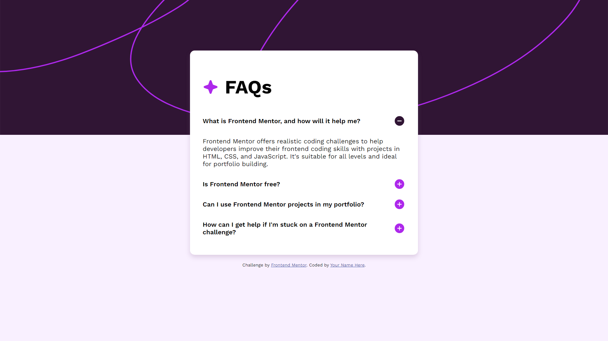

# Frontend Mentor - FAQ accordion solution

This is a solution to the [FAQ accordion challenge on Frontend Mentor](https://www.frontendmentor.io/challenges/faq-accordion-wyfFdeBwBz). Frontend Mentor challenges help you improve your coding skills by building realistic projects.

## Table of contents

- [Overview](#overview)
  - [The challenge](#the-challenge)
  - [Screenshot](#screenshot)
- [Notes](#notes)
- [Author](#author)

## Overview

### The challenge

Users should be able to:

- Hide/Show the answer to a question when the question is clicked
- Navigate the questions and hide/show answers using keyboard navigation alone
- View the optimal layout for the interface depending on their device's screen size
- See hover and focus states for all interactive elements on the page

### Screenshot

## Notes

This is my 2nd challenge in Frontend Mentor, and definitely a step-up in difficulty, having been in a roadblock on the first half dealing with CSS and positioning.

With this challenge, included new requirements, such as:

- *More* optimized readability of code
- Improved CSS handling with positioning
- Flexible sizing of panels
- Use of Javascript for the accordion effect
- Changing states of elements and CSS properties

Overall, the process was as enjoyable as it was difficult, while there were many new unfamiliar features, I learned a lot and am excited to take on new challenges.

## Author

- Github - [Bazel](https://github.com/8BitSoda)
- Frontend Mentor - [8BitSoda](https://www.frontendmentor.io/profile/8BitSoda)